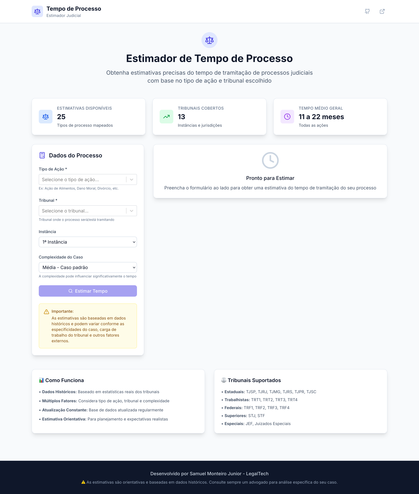
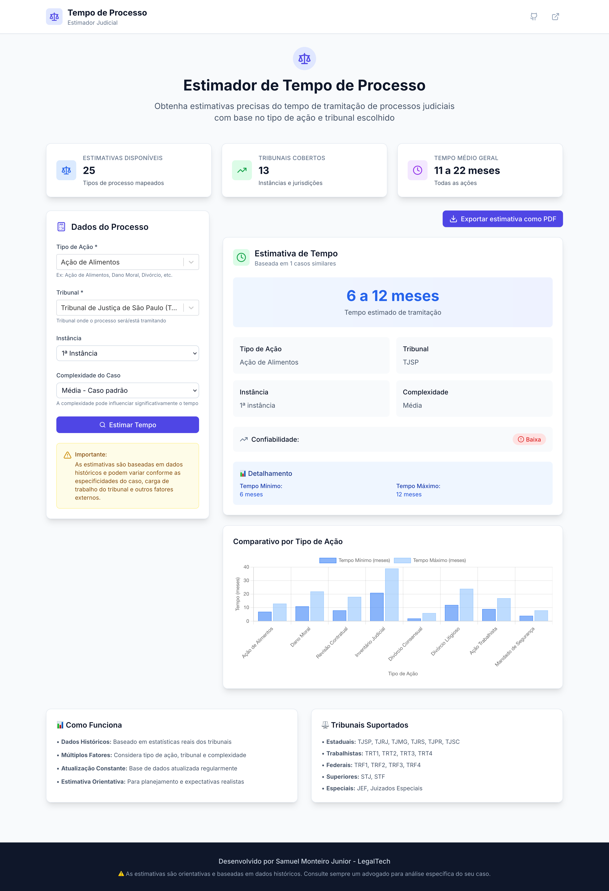
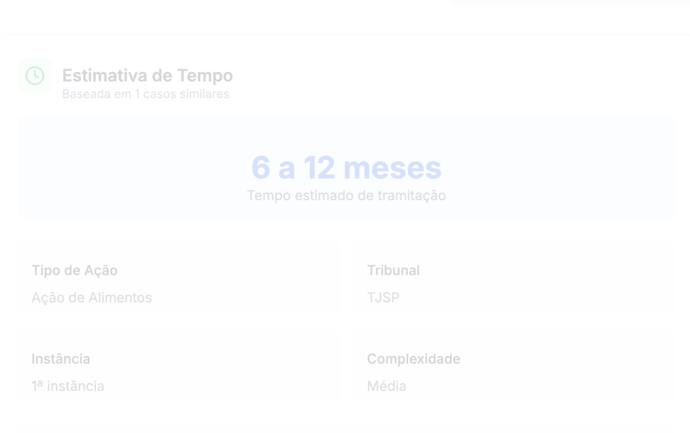

# Prazo-Legal ⚖️

**SaaS MVP 2026 – Estimador inteligente de tempo de processo judicial**

Ferramenta moderna para advogados obterem estimativas realistas de tramitação com base em tipo de ação, tribunal e complexidade.

## Design
- Paleta indigo/blue premium  
- Dark/Light mode automático  
- Fonte Inter + animações suaves  
- Totalmente responsivo

## Funcionalidades
- 25 tipos de ação mapeados  
- 13 tribunais (Estaduais, Trabalhistas, Federais, Superiores)  
- Gráficos comparativos animados  
- Exportar estimativa completa como PDF  
- Footer institucional

## Screenshots
![Tela principal]
![Estimativa gerada]
![Export PDF]

## Demo ao vivo
https://prazo-legal.vercel.app/

## Como rodar localmente
```bash
cd frontend
npm install
npm run dev